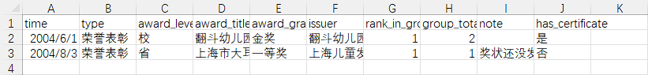
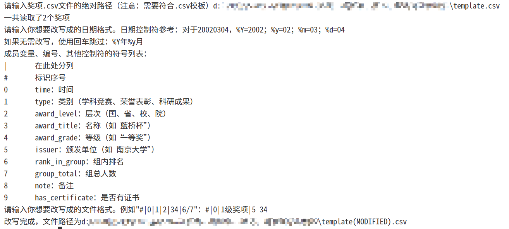
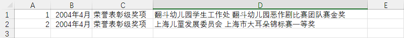

# 奖项格式翻译器 `award-format-adjuster`

## 背景

由于奖项对于中国学生来说非常重要，一个好习惯是维护一个简单的文件或者小型数据库，来存放这些奖项。但是，不同场合需要提交不同的奖项文件，例如：

1. 学年末评奖评优时，要提交类似 `2020年2月 XX大学XX学院最美宿舍 一等奖` 等格式的信息。
2. 学期中某学生组织收集获奖信息，要提交类似 `2020.2.3 XX大学XX学院 最美宿舍一等奖 1/4` 等格式的信息。

因此，当奖项数量众多时，这项工作会变得非常繁琐！

## 解决方案

为了解决这个问题，我们开发了一个名为奖项格式翻译器的小工具！

首先，您需要准备一个符合规则的 `*.csv` 文件。我们在该目录下提供了一个模板文件 `template.csv`，它的格式如下所示：

然后，运行 Python 代码，并输入：

1. 想要修改成的时间格式。
2. 想要修改成的获奖信息格式。

例如：

 

完成后，您将得到一个新的文件 `template(MODIFIED).csv`。这将极大地简化后续的手动操作！

 

## 后记

我期望奖项不仅仅是一个人的标签或代表个人的身份。

奖项应该是对个人成就和努力的认可，同时也应该鼓励人们追求卓越和个人成长。奖项并不是衡量一个人价值的唯一标准，每个人都有独特的才华和潜力，每个人都值得被尊重和重视——无论它们有多少奖项。

个人的价值和身份远远超出了奖项本身。重要的是要相信自己的价值，并在追求个人目标和成就的过程中保持真实和坚定。

我希望越来越少的人需要耗费心力，精打细算地维护这个不能完全代表自己的表格。
